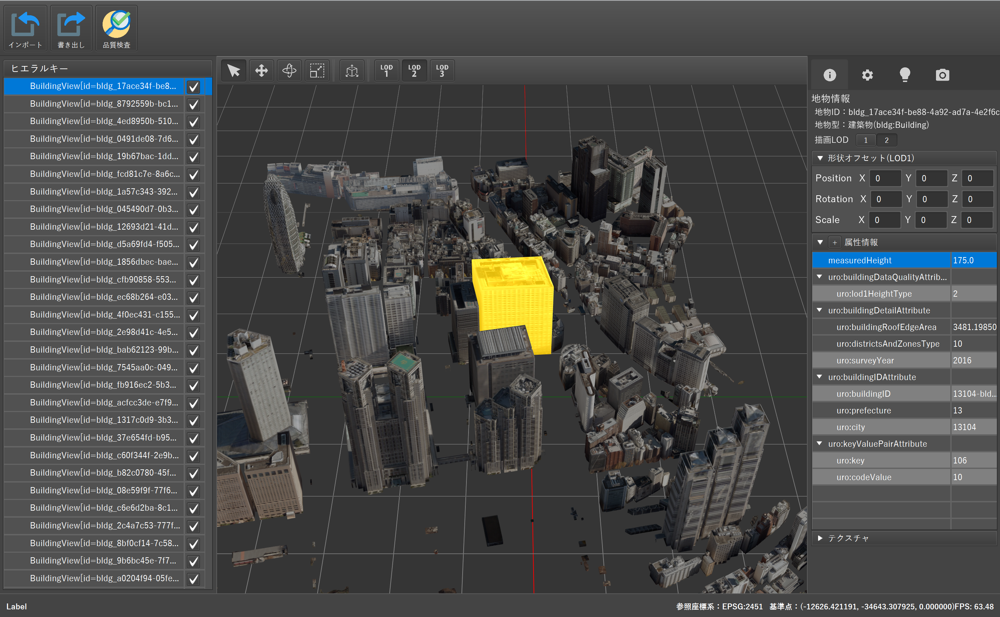

# PLATEAU Builder
PLATEAUの標準製品仕様書（第3.2版）に準拠したCityGMLデータの編集・品質検査を行うためのシステムです。

本ツールのソースコードについては[GitHub](https://github.com/Project-PLATEAU/PLATEAU-CityGML-Editor)を参照してください。

また、本ツールは現状は初期開発フェーズであり、来年度以降によりターゲット業務の明確化・機能追加していく計画をしております。

