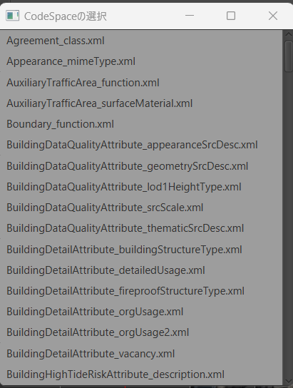

# 属性情報の編集

このページでは、**地物の属性情報を編集**する際の手順や方法を解説します。操作手順は、大きく以下の 2 つに分かれます。

1. **ツール上で直接編集**
2. **CSV ファイルを出力・編集してインポート**

いずれの方法でも、最終的に CityGML の属性情報へ反映されます。作業規模やワークフローに合わせて使いやすい方をお選びください。

---

## 1. ツール上で直接編集する方法

ヒエラルキー一覧または 3D ビュー上で対象の地物を選択すると、画面右（地物情報パネル）にその地物の情報が表示されます。  
※複数の地物を一括選択している場合は、**共通する属性のみ**が表示され、追加・編集・削除は選択中の全地物に同時適用されます。

上図の「属性情報パネル」から、属性の追加・削除・編集が可能です。

### 1-1. 個別編集

既存の属性を修正する際は、**値欄をダブルクリック**し、表示されたテキストフィールドで編集します。  
`uom` や `codeSpace` など、CityGML 特有の属性をまとめて編集したいときは、属性を**右クリック → [編集]** で専用の編集画面を開けます。

#### CodeType の編集

CodeType 型の属性を編集するときは、以下の画面が表示されます。  

1. **「一覧から選択」** を押して、一覧から CodeList の XML ファイルを指定する。  
   
2. **「値を選択」** を押して、候補から適切なコード値を選択。  
   
3. **「追加」** ボタンで編集内容を確定。

#### MeasureType の編集

MeasureType 型の属性編集画面では、`uom` と数値の入力欄があります。  

1. `uom` と値を入力
2. **「追加」** ボタンを押して適用

これにより、`bldg:measuredHeight` などの情報を単位付きで管理できます。

---

### 1-2. 属性情報の追加

新規属性を追加する場合は、属性情報パネルの **「＋」ボタン** を押し、以下のような画面を開きます。既存の親要素に追加する場合は、その親属性を右クリックして「追加」を選びます。

追加画面では、**タグ名一覧**が表示され、上部の検索パネルでフィルタリングが可能です。

属性をダブルクリックすると、**必須入力項目や型別の編集画面**が表示されます（[個別編集](#1-1-個別編集)の画面と同様）。親要素を追加する場合は、全ての必須属性について編集をおこないます。

入力を終えたら**「追加」**ボタンで確定し、属性が生成されます。

---

### 1-3. 属性情報の削除

削除したい属性を右クリックし、 **「削除」** を選ぶと、その属性情報が地物から外れます。

---

## 2. CSV を用いて編集する方法

**多数の地物の属性を一括編集・一括削除**する場合や、Excel などで一括管理したい場合には、CSV エクスポート/インポートを活用します。

### 2-1. CSV のエクスポート

画面上部の **「CSV」ボタン → [エクスポート]** を選択し、エクスポート画面を開きます。  

1. **出力先** を指定（デフォルトは CityGML ファイル直下の CSV フォルダ）
2. **「エクスポート」** ボタンを押すと、地物全体の属性情報が CSV に出力されます。

---

### 2-2. エクスポートされた CSV の編集

エクスポート結果の CSV は、任意のテキストエディタや Excel で開いて編集できます。**1 行が 1 地物**、**列が属性**に対応します。

-   全ての地物に対して特定属性を削除したい場合は、該当する列を削除 or 2 行目以降を空白化
-   新たな属性を追加するには、列を新設したうえでヘッダを属性名に合わせる

#### CSV フォーマットのポイント

1. **gml:id** をキーとした 1 地物 1 レコード
2. **1 行目はヘッダ行**、2 行目以降がデータ行
3. 属性名が重複する場合は `_[連番]` が付く（※連番は 1 から開始）
4. 階層構造や `uom` / `codeSpace` は 親名 + `_` + 子名 で表現

#### 例

| gml:id                              | bldg:measuredHeight | uro:buildingIDAttribute_uro:buildingID | uro:buildingDetailAttribute_1_uro:surveyYear | uro:buildingDetailAttribute_2_uro:districtsAndZonesType | bldg:measuredHeight_uom |
| ----------------------------------- | ------------------- | -------------------------------------- | -------------------------------------------- | ------------------------------------------------------- | ----------------------- |
| bldg_18c5e09c-9118-4e63-b85e-389814 | 92.3                | 13104-bldg                             | 2016                                         | 10                                                      | m                       |
| bldg_58a6e11b-7492-ac98-89b7-837487 | 45.7                | （空白）                               | 2020                                         | 10                                                      | （空白）                |

-   uro:buildingDetailAttribute が 2 つあるため、 uro:buildingDetailAttribute_1,uro:buildingDetailAttribute_2 が存在
-   uro:buildingIDAttribute_uro:buildingID は、uro:buildingIDAttribute を親とする uro:buildingID を表す属性カラム
-   bldg:measuredHeight_uom は、measuredHeight の uom を設定するカラム

> [!WARNING]
> CSV 形式が破損すると、インポートエラーが発生する場合があります。ヘッダ行を大きく書き換える際は注意してください。

---

### 2-3. CSV のインポート

編集を終えたら、画面上部の **「CSV」ボタン → [インポート]** を選択し、インポート画面を開きます。

1. **編集後の CSV ファイル** を指定
2. **「インポート」** ボタンを押す
    - 成功すると 「対象の CSV の読み込みが完了しました。」 と表示
    - 不正な行や属性があればエラー文で通知

これにより、CSV 内で修正した内容が各地物に反映されます。大量の属性変更や削除がある場合に便利です。

---

## 3. まとめ

-   **少量の属性編集や確認** → [ツール上で直接編集](#1-ツール上で直接編集する方法)が簡単
-   **一括更新や外部ツール(Excel)での管理** → [CSV を用いた編集](#2-csvを用いて編集する方法)が効率的

どちらの方法でも同じ CityGML 属性に反映されるため、使い分けて効率良く管理してください。
