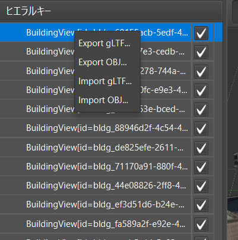

# 形状情報の編集

このページでは、地物の形状を編集するための手順と、それぞれの機能について解説します。地物の形状を外部ツールで修正したい場合や、面ごとの地物型（屋根・壁・開口部など）を微調整したい場合に参照してください。

## 1. 3Dファイルのエクスポート
本ツール内の地物データを元に3Dファイルを作成したい場合、まずは以下の手順でエクスポートします。既存の地物形状を参照せずに一から作成する場合は、このステップは不要です。

1. **エクスポートしたい地物を右クリック**
    - ヒエラルキー(一覧)で対象を選択し、右クリック → OBJ または glTF を選んで「3Dエクスポート画面」を開きます。  
      

2. **エクスポート設定を行い「エクスポート」**
    - 以下の画面で、出力先・LOD・参照座標系・基準点位置などを設定し、「エクスポート」ボタンを押します。  
      

### エクスポート画面の主な項目

| 項目          | 説明                                                             |
|-------------|----------------------------------------------------------------|
| **出力先**     | エクスポートする3Dファイルの保存先を指定します。                                      |
| **LOD**     | 出力対象のLODを指定します。                                                |
| **参照座標系**   | CityGMLインポート時に設定された座標系が表示されます。                                 |
| **基準点位置**   | 3Dファイルの座標原点をどの地点に合わせるか設定します。大きな値による桁落ちを防ぐため、原点に近い座標へ補正する仕組みです。 |
| **東向きの軸**   | 3Dファイルで"東"にあたる軸を X, Y, Z, -X, -Y, -Z の中から選択します。                |
| **上向きの軸**   | 3Dファイルで"上"にあたる軸を X, Y, Z, -X, -Y, -Z の中から選択します。                |

> [!NOTE]
> **基準点位置について**  
> OBJやglTFなど一部形式では、座標を小数点以下数桁までに制限して記録するため、非常に大きな数値の場合は桁落ち（精度低下）が起こる恐れがあります。  
> そこで、3Dファイルのエクスポート時は「基準点位置」を基準にオフセットをかけることで、原点付近の値になるよう調整しています。デフォルトでは最初にインポートしたCityGMLのEnvelope中心が使用されます。

---

## 2. 外部ツールでの形状編集
エクスポートした3Dファイル（OBJ, glTFなど）は、Maya・Blender・3dsMaxなどの外部DCCツールで編集できます。
- **ポリゴンの頂点移動・面の追加削除・UV編集**など自由に行えます。
- 編集を終えたら、**同じフォーマット(OBJまたはglTF)** で再度エクスポートしてください。

> [!NOTE]
> 建築物の場合は各面の地物型（壁・屋根など）はインポート時に自動で推定され、ツール内で修正可能です。

---

## 3. 3Dファイルのインポート
外部ツールで形状を変更したら、本ツールに再び取り込みます。

1. **ヒエラルキーで右クリック → OBJまたはglTF を選択**
    - 「3Dインポート画面」を開きます。  
      

2. **インポート設定を行い「インポート」**
    - 以下の画面でファイルパスやLOD、座標系などを指定し、「インポート」ボタンで適用します。  
      

### インポート画面の主な項目

| 項目              | 説明                                                      |
|-----------------|---------------------------------------------------------|
| **入力ファイル**      | 取り込む3Dファイル(OBJ/glTF)を指定します。                             |
| **LOD**         | インポート対象のLOD(詳細度)を指定します。                                 |
| **面検出角度の閾値**    | 建築物として認識する際、地面以外の面の法線方向が垂直上方向とどの程度ズレていれば"壁"とみなすかを設定します。 |
| **モデル配置**       | 「参照座標系を利用」を選択するとマニュアルで位置指定可能。"自動"の場合は底面位置を自動推定して配置します。  |
| **参照座標系**       | CityGMLインポート時に設定された座標系が表示されます。                          |
| **基準点位置**       | エクスポートと同様に、3Dファイルの原点をどこに合わせるか設定します。                     |
| **東向きの軸**       | ファイルでの"東"にあたる軸を X, Y, Z, -X, -Y, -Z から選択。               |
| **上向きの軸**       | ファイルでの"上"にあたる軸を X, Y, Z, -X, -Y, -Z から選択。               |

---

## 4. 地物型の修正
3Dファイルのインポート後、壁や屋根などの面が自動的に判別されますが、誤認識があれば手動で修正します。  
「**面表示モード**」をONにし、3Dビューでポリゴンをクリックすると面の地物型を変更できます。

### ポリゴン編集

1. 3Dビューで編集したいポリゴンを選択
2. 変更後の地物型を選択

> [!NOTE]
> 複数面からなる地物(壁面、屋根面等)に属する1つの面(ポリゴン)を別の地物型にすると、既存の地物から分離して"新規地物"として登録されます。

### 地物編集

- **タイプ編集**  
  地物の全ポリゴンをまとめて異なる地物型に変更します。

- **面編集**  
  既存地物からポリゴンを追加・削除し、新しい地物として再構成します。
    1. 編集したい地物を選択
    2. [編集] ボタンを押して3Dビュー上でポリゴンを指定
    3. [決定] ボタンで確定

> [!NOTE]
> 地物から削除したポリゴンは、新規地物として登録されます。

- **開口部編集**  
  窓やドア(=開口部)の追加・削除を行います。
    1. 編集したい地物を選択
    2. [編集] ボタンを押して3Dビュー上で追加/削除したい開口部を指定
    3. [決定] ボタンで確定

> [!NOTE]
> 変更後の地物型は自動で切り替わります。  
> (例) Window/ Door以外を開口部として選択した場合、Window型に変換されます。
