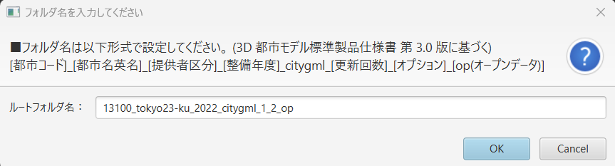

# データセットのエクスポート

本ツールで編集した3D都市モデルは、**CityGML形式のデータセット**として以下の手順で書き出せます。エクスポート後は、他のGISソフトウェアや3Dビューアなどで再利用・配布が可能です。

---

## 1. 書き出し手順

1. **トップ画面で「書き出し」ボタン**をクリック  
   
2. **データセットのフォルダ名**を入力
3. **出力フォルダの選択** → 「開く」ボタンを押下  
   

---

## 2. エクスポート結果のフォルダ構成

エクスポートが完了すると、指定したフォルダ内に以下のフォルダ群が生成されます。

- **codelists**  
- **metadata**  
- **schemas**  
- **specification**  
  元のデータセットに含まれるファイルがそのまま引き継がれます。
- **udx**  
  実際に編集されたCityGMLファイルと、それに紐づくテクスチャ画像等が含まれます。
