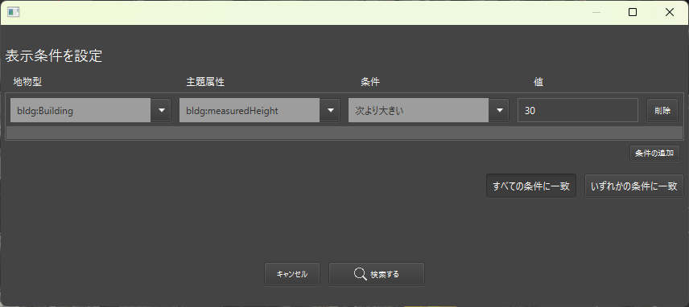

# 地物のフィルタリング

このページでは、**地物を属性情報でフィルタリング**し、必要なものだけをヒエラルキーや3Dビューに表示する方法を解説します。大規模なデータを扱う際に目的の地物を素早く見つけたい場合や異常な属性を持った地物を絞り込みたい場合などに便利です。

---

## 1. フィルター画面を開く
画面左上の**フィルターボタン**をクリックすると、下図のような**フィルター画面**が表示されます。

1. **地物型の選択**
    - 建物（Building）や道路（Transportation）など、カテゴリを指定します。
2. **主題属性の指定**
    - 特定の属性（用途、名称、標高など）を指定します。
3. **条件 / 値の入力**
    - 「一致する」「次より小さい」などの演算条件と検索値を組み合わせて絞り込みます。
4. **検索する**
    - ボタンを押すと、条件に合致する地物だけがヒエラルキーと3Dビューに表示されます。

---

## 2. フィルター結果の表示と操作
条件を指定して **「検索する」** をクリックすると、

- **ヒエラルキー**: 条件に合致しない地物は非表示化される
- **3Dビュー**: 条件外の地物は表示されず、対象だけがマップ上に残る

---

## 3. フィルター条件の保存・読み込み

### 3-1. 「書き出し」ボタン
現在設定しているフィルター条件を外部ファイルに保存できます。よく使うフィルターを**プリセット**として登録しておきたい際に利用してください。

### 3-2. 「読み込み」ボタン
以前に保存したフィルター設定を**一括で読み込み**、すぐに同じ条件で検索できます。複雑な条件を再入力する手間が省けます。

---

## 4. フィルターの解除

フィルターを無効化するには、 画面左上の「クリア」ボタンを押下します。
