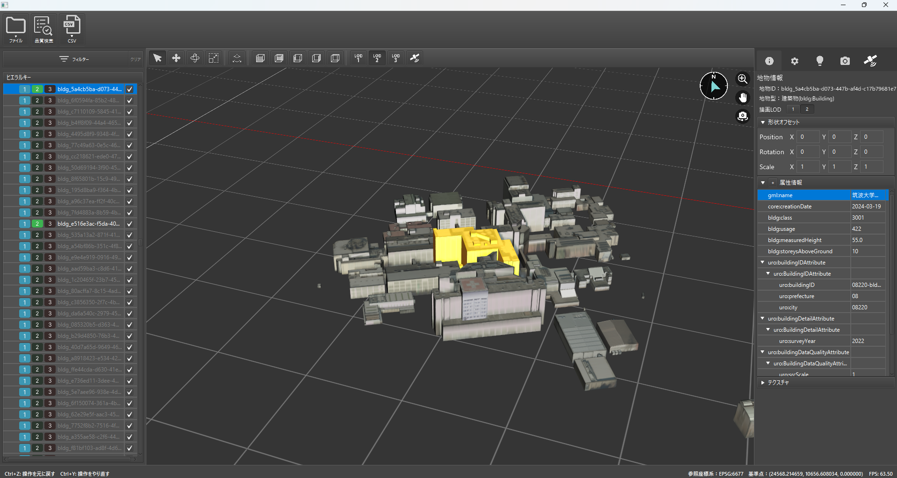
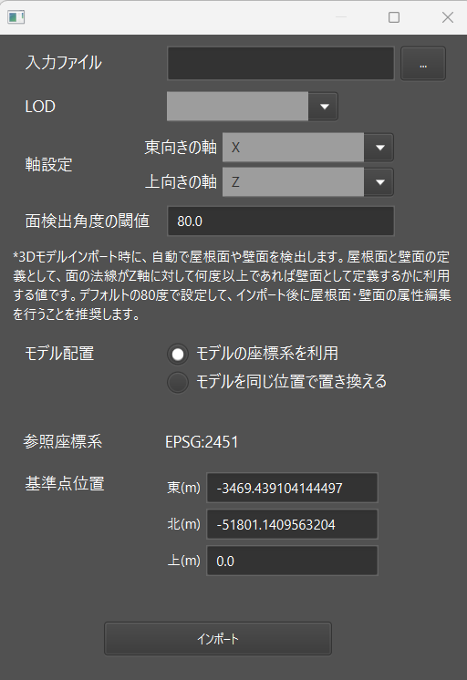
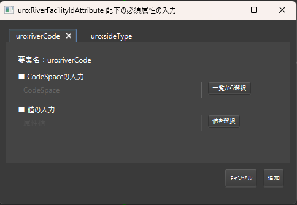
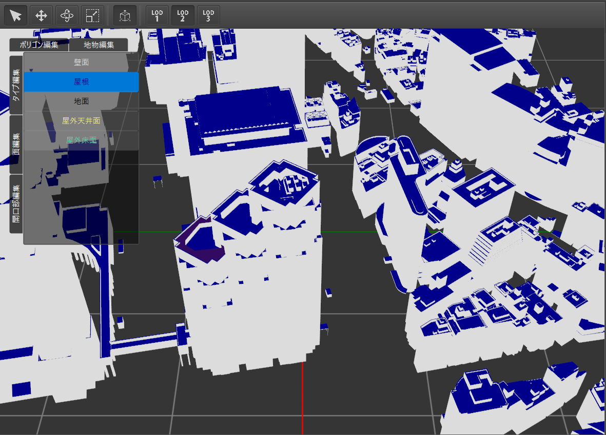

# 操作マニュアル

## 1. 本書について
本書では、CityGML編集ツール（以下「本ツール」という）の画面・使い方・扱うデータについて記載しています。
- 本ツールの各画面の表示内容や構成の詳細については、「2. 画面」を参照してください。
- 本ツールの使い方については、「3. 使い方」を参照してください。
- 本ツールで扱うインポート/エクスポートデータについては、「4. 扱うデータ」を参照してください。

## 2. 画面

## 2-1. トップ画面
本ツールの実行ファイルを実行すると、以下の画面が表示されます。

CityGMLデータのインポートを行うと、以下のような表示内容になります。

### ①CityGMLインポートボタン
CityGMLインポートを行います。ボタン押下後に「2-2.CityGMLインポート画面」へ移動します。
### ②書き出しボタン
データセットエクスポートを行います。ボタン押下後に「2-3.データセットエクスポート画面」へ移動します。
### ③品質検査ボタン
品質検査を行います。ボタン押下後に「2-4.品質検査画面」へ移動します。
### ④地物一覧エリア
インポートしたデータの地物一覧を表示します。
右クリックで3Dファイルのインポート/エクスポートメニューを出すことができます。
### ⑤3Dビューエリア
インポートしたデータを3Dで描画します。

また、上部のメニューボタンを切り替えることで、マウス操作によって地物を移動・回転したり、描画するLODを変更できます。

||項目名|操作説明|イメージ|
|---|---|---|---|
|①|選択モード|マウスポインタによって地物を選択できます||
|②|移動モード|矢印をマウスで掴み移動させることで、地物を直線移動できます||
|③|回転モード|青い円上をマウスで掴み移動させることで、地物を回転できます||
|④|スケールモード|矢印をマウスで掴み移動させることで、地物を直線方向に拡大縮小できます||
|⑤|面表示モード|面（屋根面・壁面など）の定義ごとに色分けして表示できます||
|⑥|LODモード|描画するLODを変更できます||

### ⑥地物詳細エリア
地物一覧もしくは3Dビュー上で選択されている地物について、各属性値などを表示します。

|項目名|説明|編集|
|---|---|---|
|地物情報|CityGMLファイル内で定義されている地物IDと地物型|✕|
|描画LOD|3Dビュー上に表示するLOD|◯|
|形状オフセット|位置情報とスケール情報|◯|
|属性情報|[3D都市モデル標準製品仕様書](https://www.mlit.go.jp/plateaudocument/)で定義されている各属性値|◯|
|テクスチャ|地物のテクスチャ情報|◯|

## 2-2. CityGMLインポート画面
ファイル選択ウィンドウが表示され、PC上からインポートするCityGMLファイルを選択することができます。
その後、座標系を選択することができます。

## 2-3. データセットエクスポート画面
エクスポートするデータセットのファイル名を入力できます。その後、ファイル選択ウィンドウが表示され、エクスポートするPC上のフォルダを選択することができます。

## 2-4. 品質検査画面
品質検査パラメータと出力先フォルダをPC上で選択できます。
実行ボタン押下後に品質検査が実行され、画面上にログが出力されます。

## 3. 使い方

## 3-1. CityGMLデータをインポートする
トップ画面にて、インポートボタン押下後にインポートするCityGMLデータを選択し、開くボタンを押下します。

対象の都道府県が含まれる座標系を選択し、インポートボタンを押下します。

## 3-2. CityGMLデータを3Dで視覚的に確認する
CityGMLデータのインポートを行うと、トップ画面-3Dビューエリアにて、各地物を3Dにて視覚的に確認できます。

また、以下の操作によって視点の回転・移動を行うことができます。
|制御|操作|
|---|---|
|マウスの右ボタン＋ドラッグ|視点を回転させます。|
|マウスの中央（ホイール）ボタン＋ドラッグ|視点を移動させます。|
|スクロール|視点をズームイン・アウトさせます。|
|地物をダブルクリック|視点を地物にフォーカスさせます。|

## 3-3. 地物の形状を更新する
他ツールなどで作成済みの3Dファイルをインポートして、地物の形状を更新することができます。

### 3Dファイルをエクスポートする
3Dファイルの作成にあたって、本ツール内の地物をもとに作成したい場合は、本ツールから3Dファイルをエクスポートします。
※本ツール内の地物をもとに作成しない場合には、こちらの実施は不要です。

トップ画面-地物一覧エリアにて右クリックを押下して、OBJファイルもしくはglTFファイルを選択し3Dエクスポート画面を開きます。

※TODO: 画像更新

3Dファイルエクスポート画面では以下の項目が設定できます。

|項目|説明|
|---|---|
|出力先|エクスポートする3Dファイルのパスを設定します。|
|LOD|エクスポートするLODを指定します。|
|参照座標系|CityGMLインポート時に設定された参照座標系が表示されます。|
|基準点位置|参照座標系内での3Dファイルの原点位置を設定します。|
|東向きの軸|X, Y, Z, -X, -Y, -Zから3Dファイルの東向きの軸を設定します。|
|上向きの軸|X, Y, Z, -X, -Y, -Zから3Dファイルの上向きの軸を設定します。|

### 3Dファイルをインポートする

トップ画面-地物一覧エリアにて右クリックを押下して、OBJファイルもしくはglTFファイルを選択し3Dインポート画面を開きます。

※TODO: 画像更新

3Dファイルエクスポート画面では以下の項目が設定できます。

|項目|説明|
|---|---|
|入力ファイル|インポートする3Dファイルのパスを設定します。|
|LOD|インポートするLODを指定します。|
|モデル配置|「参照座標系を利用」を選択した場合、手動で位置の指定ができます。「自動」の場合は形状の底面位置が合うように自動で位置合わせが行われます。|
|参照座標系|CityGMLインポート時に設定された参照座標系が表示されます。|
|基準点位置|参照座標系内での3Dファイルの原点位置を設定します。|
|東向きの軸|X, Y, Z, -X, -Y, -Zから3Dファイルの東向きの軸を設定します。|
|上向きの軸|X, Y, Z, -X, -Y, -Zから3Dファイルの上向きの軸を設定します。|

## 3-4. 地物の属性を編集する
トップ画面-地物一覧エリアもしくは3Dビューエリアにて該当地物を選択すると、地物詳細エリアに地物情報が表示されます。

地物情報パネル内の属性情報パネルから、属性情報の追加・削除・編集を行えます。

### 属性情報の編集
既存項目を編集したい場合は、値の欄をダブルクリックして値を修正します。CityGMLのattribute情報も編集したい場合は右クリックしてから「編集」を選択して属性編集画面を開いてください。

#### CodeTypeの編集

属性がCodeType型の場合、以下の手順でCodeSpaceと値を入力します。

1. 「CodeSpaceの選択」を押下し、一覧からCodeListのXMLファイルを選択します。

2. 一覧からCodeTypeの値を選択します。

#### MeasureTypeの編集

属性がMeasureType型の場合、画面からuomおよび値を入力します。

### 属性情報の追加
地物に新規属性を追加するには、＋ボタンを押下して属性追加画面を開きます。既に追加されている親要素に新規属性を追加したい場合は親属性を右クリックしてから「追加」を選択してください。

属性追加画面では追加したい属性のタグ名を選択します。画面上部の検索パネルを入力すると入力文字列でタグ名の一覧がフィルタリングされます。

属性をダブルクリックすると追加属性の編集画面が開きます。基本的には[属性情報の編集](#属性情報の編集)と同様の画面が表示されますが、親要素の追加の際は必須属性の編集画面が表示されます。

各必須属性を入力した後、追加ボタンを押すことで属性が追加されます。

## 3-5. 地物の面（屋根面・壁面など）を編集する
地物の面を編集するには、「面表示モード」をONにして面編集画面を開きます。

### ポリゴン編集パネル

ポリゴン編集パネルでは以下の手順で各ポリゴンの地物型を編集できます。

1. 3Dビューから編集したいポリゴンを選択します。
2. 変更後の地物型を選択します。

ポリゴンの地物型が変更されると、建築物のboundedBy要素として新しい地物が生成され、その子要素としてポリゴンが登録されます。

### 地物編集パネル

地物編集パネルでは「タイプ編集」、「面編集」、「開口部編集」が行えます。

#### タイプ編集

ポリゴン編集パネルでは以下の手順で各地物の地物型を編集できます。

1. 3Dビューから編集したい地物を選択します。
2. 変更後の地物型を選択します。

#### 面編集
面編集パネルでは以下の手順で各地物のポリゴンを追加・削除できます。

1. 3Dビューから編集したい地物を選択します。

2. 編集ボタンを押した後、追加・削除したいポリゴンを3Dビュー上で選択します。

3. 決定ボタンを押すと変更が適用されます。

#### 開口部編集
開口部編集パネルでは以下の手順で各地物の開口部を編集できます。

1. 3Dビューから編集したい地物を選択します。

2. 編集ボタンを押した後、追加・削除したい開口部を3Dビュー上で選択します。

3. 決定ボタンを押すと変更が適用されます。

適用後に地物型が以下のように変換されます。
- Window、Door型以外の地物を開口部として選択した状態で変更が適用された場合、Window型に変換されます。
- 地物が開口部から削除された場合、WallSurface型に変換されます。

## 3-6. CityGMLデータを品質検査する
トップ画面から品質検査ボタンを押して品質検査画面を開きます。

品質検査パラメータと出力フォルダを変更したい場合、参照ボタンを押下して各ファイルを指定します。

実行ボタンを押下するとインポートされた3D都市モデルに対して品質検査処理が実行され、画面上の品質検査ログ画面に品質検査結果が表示されます。

品質検査でエラーが検知された場合、赤文字でエラーメッセージが表示されます。各メッセージをクリックすることでエラーが発生している地物が3Dビュー上で選択され、メッセージの詳細が確認できます。また、エラーが発生しているポリゴンは3Dビュー上で赤色でハイライトされます。

## 3-7. CityGMLのデータセットをエクスポートする
編集した3D都市モデルは以下の手順でCityGMLのデータセットとしてエクスポート出来ます。
1. トップ画面から書き出しボタンを押下します。
2. データセットのフォルダ名を入力します。

3. 出力フォルダを選択し、開くボタンを押下します。

エクスポートが完了するとエクスポート先のフォルダが開きます。

## 4. 扱うデータ
## 4-1. CityGMLデータ
CityGMLインポート機能でインポートできるデータは以下のとおりです。

| ファイル構成 | 内容 |
|---|---|
|XXXXX.gml|citygml形式のファイル|

## 4-2. 3Dファイルデータ
3Dファイルインポート機能でインポートできるデータは以下のとおりです。

| ファイル構成 | 内容 |
|---|---|
|XXXXX.obj もしくは XXXXX.gltf|OBJもしくはglTF形式のファイル|

## 4-3. データセット
データセットエクスポート機能で出力されるデータは以下のとおりです。

| ファイル構成 | 内容 |
|---|---|
|codelists|3D都市モデル標準製品仕様書Ver.3.2で定義されているコード値ファイルと、インポートしたCityGMLデータに含まれるコード値ファイル|
|metadata|インポートしたCityGMLデータに含まれるmetadataファイルをもとに、日付やデータに含まれる地物型/LODの値のみ変更したファイル|
|schemas|インポートしたCityGMLデータに含まれるschemasファイル|
|specification|インポートしたCityGMLデータに含まれるspecificationファイル|
|udx|インポートしたCityGMLデータに含まれる全ての地物の3D都市モデルファイル|

