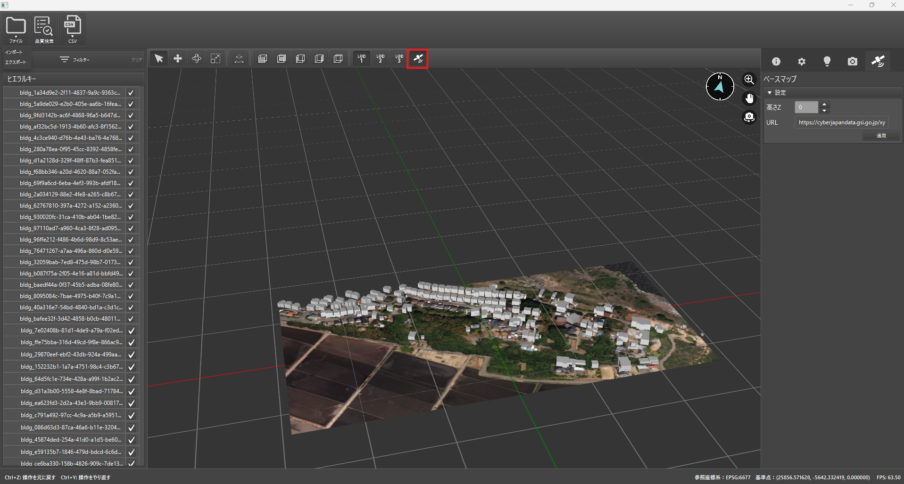
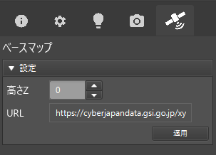

# ベースマップの表示

このページでは、**ベースマップ（背景地図）を3Dビューに重ねて表示する方法**を解説します。ベースマップを使用することで、建物や道路などの3D都市モデルを地理的に位置付けた状態で確認できます。

---

## 1. ベースマップのON/OFF

1. **3D都市モデルをインポート**した状態で、画面上部の **「ベースマップ切替」ボタン** をクリックします。
    - ボタンを押すごとに、ベースマップの表示と非表示が切り替わります。
2. **ON**になっている場合は、3Dビューに背景として地図タイルが読み込まれます。
3. **OFF**の場合、ベースマップなしの表示に戻ります。

> [!WARNING]
> べースマップの表示にはインターネット接続が必要です。

---

## 2. 標示高さの調整

ベースマップの高さはデフォルトで**0m**として描画されます。実際のモデルの高さと合わない場合は、画面右側の **「ベースマップ」タブ** で数値を変更できます。

1. **「ベースマップ」タブ**を開く
2. **「高さ」** フィールドで、標高をメートル単位で入力
3. **「適用」ボタン**を押すと、高さが更新されます
